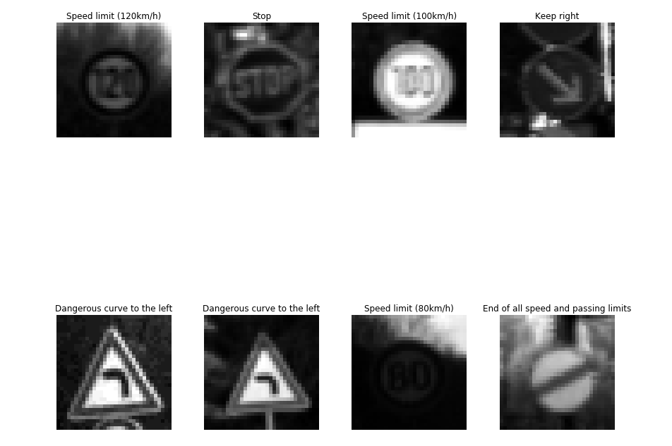
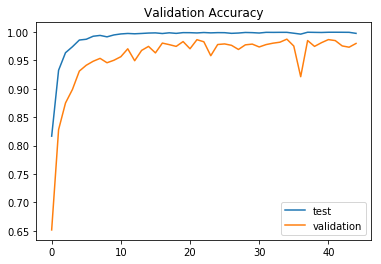

# **Traffic Sign Recognition** 

**Build a Traffic Sign Recognition Project**

The goals / steps of this project are the following:
* Load the data set (see below for links to the project data set)
* Explore, summarize and visualize the data set
* Design, train and test a model architecture
* Use the model to make predictions on new images
* Analyze the softmax probabilities of the new images
* Summarize the results with a written report

[image1]: ./examples/visualization.jpg "Visualization"
[image2]: ./examples/grayscale.jpg "Grayscaling"
[image3]: ./examples/random_noise.jpg "Random Noise"
[image4]: ./examples/placeholder.png "Traffic Sign 1"
[image5]: ./examples/placeholder.png "Traffic Sign 2"
[image6]: ./examples/placeholder.png "Traffic Sign 3"
[image7]: ./examples/placeholder.png "Traffic Sign 4"
[image8]: ./examples/placeholder.png "Traffic Sign 5"

## Rubric Points

* Objectives of project -
1. Submission of file : Ipython notebook with code, HTML output of the code and a writeup report.

* Dataset Exploration -
2. Dataset summary
3. Exploratory Visualization : visualization of dataset.

* Design and test a model architecture -
4. Preprocessing : describe and explain preprocessing techniques used.
5. Model Architecture : Details of model explaining its architecture.
6. Model training
7. Solution Approach

* Test the model on New Images -
8. Acquire new images to be tested.
9. Explain the performance of Neural Network on new images.
10. Model Certainty-Softmax Probability.

### Writeup / README

#### 1. Provide a Writeup / README that includes all the rubric points and how you addressed each one. You can submit your writeup as markdown or pdf. You can use this template as a guide for writing the report. The submission includes the project code.

You're reading it! and here is a link to my [project code](https://github.com/drtupe/Traffic_Sign_Classifier/blob/master/Traffic_Sign_Classifier_final.ipynb)

### Data Set Summary & Exploration

#### 1. Provide a basic summary of the data set. In the code, the analysis should be done using python, numpy and/or pandas methods rather than hardcoding results manually.

I used the pandas library to calculate summary statistics of the traffic
signs data set:

* The size of training set is 34799
* The size of test set is 12630
* The shape of a traffic sign image is (32, 32, 3)
* The number of unique classes/labels in the data set is 43

#### 2. Include an exploratory visualization of the dataset.

Following you will see the detailed dataset structure, the plotting occurance of each image class to get an idea of how the data is distributed in dataset. This can help you understand where potential pitfalls could occur if the datset isn't uniform in terms of baseline occurance.

### Design and Test a Model Architecture

#### 1. Describe how you preprocessed the image data. What techniques were chosen and why did you choose these techniques? Consider including images showing the output of each preprocessing technique. Pre-processing refers to techniques such as converting to grayscale, normalization, etc.

As a first step, I decided to convert the images to grayscale because the technical paper outlined several steps that was used to achieve 99% accuracy result and offcourse its easy to implement, It works better because the excess information only adds extra confusion into the learning process. After grayscale processing, normalization of the images in data was done, it helped to speed up the training and performance. 

Here is an example of a traffic sign image before and after grayscaling.

Following are the results after normalization of the images:

#### 2. Describe what your final model architecture looks like including model type, layers, layer sizes, connectivity, etc.) Consider including a diagram and/or table describing the final model.

My final model consisted of the following layers:

| Layer         		|     Description	        					| 
|:---------------------:|:---------------------------------------------:| 
| Input         		| 32x32x1 RGB image   							| 
| Convolution 5x5     	| 2x2 stride, valid padding, outputs 28x28x6 	|
| RELU					|												|
| Max pooling	      	| 2x2 stride,  outputs 14x14x6 					|
| Convolution 5x5     	| 2x2 stride, valid padding, outputs 10x10x16 	|
| RELU					|												|
| Max pooling	      	| 2x2 stride,  outputs 5x5x16 					|
| Convolution 1x1     	| 2x2 stride, valid padding, outputs 1x1x412 	|
| RELU					|												|
| Fully connected		| input 412, output 122 						|
| RELU					|												|
| Dropout				| 50% keep     									|
| Fully connected		| input 122, output 84  						|
| RELU					|												|
| Dropout				| 50% keep     									|
| Fully connected		| input 84, output 43   						| 

#### 3. Describe how you trained your model. The discussion can include the type of optimizer, the batch size, number of epochs and any hyperparameters such as learning rate.

To train the model, I used an LeNet model as my base, but to try on something new on my own I added an additional convolution without a max pooling layer. I used the AdamOptimizer with a learning rate of 0.00097. The EPOCH used was 45 while the batch size was 120. Other important parameters which I tried to change and play around were various different distributions of image class counts and it had some notable effects on the training set accuracy. As stated during the lecture, using a basic LeNet model would had been sufficient for getting 94% accuracy with virtually no change on the test set but that would had hampered hands-on-learing. When I finally stopped testing I got 94% accuracy on the test set.

#### 4. Describe the approach taken for finding a solution and getting the validation set accuracy to be at least 0.93. Include in the discussion the results on the training, validation and test sets and where in the code these were calculated. Your approach may have been an iterative process, in which case, outline the steps you took to get to the final solution and why you chose those steps. Perhaps your solution involved an already well known implementation or architecture. In this case, discuss why you think the architecture is suitable for the current problem.

My final model results were:
* training set accuracy of 99.8
* validation set accuracy of 98 
* test set accuracy of 93.9

If an iterative approach was chosen:

* What was the first architecture that was tried and why was it chosen?
    * I have used a architecture which is very similar to the paper attached at the begin. I used it because as they got a good score and steps were defined quite clearly
    
* What were some problems with the initial architecture?
    * There was no such issue with the architecture as such, some other issues which I faced were insufficient data for few labels in given dataset and lack of knowledge of tuning parameters. Lack of data issue was solved by modifying few images from the data to add to training dataset. And the issue of tuning parameters can only be solved by working more on neural networks and gaining more experience.

* How was the architecture adjusted and why was it adjusted?
    * No major adjustments were made to the architecture, however as mentioned earlier, addition of droupouts with a 50% probability was made to see try on and see the effects of making such addition on our own.

* Which parameters were tuned? How were they adjusted and why?
    * EPOCH, batch size and learning rates were the paramenters which I tuned the most to get the necessary results. EOPCH was one of the most altered parameter, as the performance and time required to run the network was depended on it along with the batch size. Batch size also affects the processing time by a lot. A large batch size result in faster process in training but it don't converge fast where as a small batch size results in slower progress in training but can converge at much faster rate. I started with 30 EPOCH and 128 batch size, but was not getting the expected results. After various iteration with different EPOCH and batch size I found a satisfactory results at EPOCH at 45 and batch size at 120. As instructed by many 0.001 is the best learing rate to start from, but while iterating and looking for better results, at one point I thought if this learning rate is larger for my model, during which I starting tuning the learning rate too and reduced it to 0.00097 which got me satisfactory output. One other thing which affected my result wasa the data images generated with random modification to increase the dataset for training. Increasing the dataset for training for lesser known labels was a good idea to be implemented.

* What are some of the important design choices and why were they chosen? For example, why might a convolution layer work well with this problem? How might a dropout layer help with creating a successful model?
    * The dropout probability mattered a lot at early stage of training, but after few iterations I freezed the dropout to 50%. The biggest that effected my accuracy was the data images generated with random modifications. This helped improve my accuracy as it increased the samples of the image dataset which had less number of samples initially.

### Test a Model on New Images

#### 1. Choose five German traffic signs found on the web and provide them in the report. For each image, discuss what quality or qualities might be difficult to classify.

Here are five German traffic signs that I found on the web:

#### 2. Discuss the model's predictions on these new traffic signs and compare the results to predicting on the test set. At a minimum, discuss what the predictions were, the accuracy on these new predictions, and compare the accuracy to the accuracy on the test set (OPTIONAL: Discuss the results in more detail as described in the "Stand Out Suggestions" part of the rubric).

Here are the results of the prediction:

| Image					|     Prediction			| Accuracy			| 
|:---------------------:|:--------------------------|------------------:| 
| Speed limit (30km/h)	| Speed limit (30km/h)		|   89%				| 
| Bumpy road   			| Bumpy road				|   100%			|
| Ahead only			| Ahead only				|   100%			|
| No vehicle			| No vehicle				|   100%			|
| Go straight or left	| Go straight or left  		|   100%			|
| General caution		| General caution			|   100%			|

The model was correctly able to identify all the traffic signs with more than 80% of accuracy. The first traffic sign of Speed limit 30 km/h had the guess accuracy of 89%. The second guess by the model was made for round about traffic sign which got guess accuracy of 7%. Except for this, all the other traffic signs were guessed with 100% accuracy.

